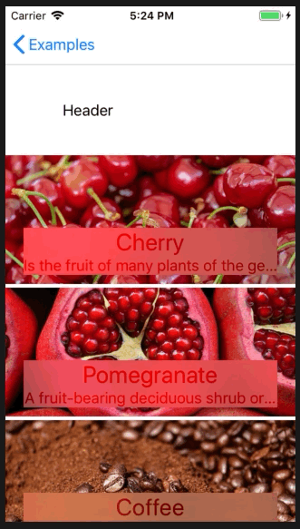

# [Bento](https://en.wikipedia.org/wiki/Bento) 🍱 弁当

> #### is a single-portion take-out or home-packed meal common in Japanese cuisine. A traditional bento holds rice or noodles, fish or meat, with pickled and cooked vegetables, in a box.

**Bento** is a Swift library for building component-based interfaces on top of `UITableView`.

- **Declarative:**  provides a painless approach for building `UITableView` interfaces
- **Diffing:** reloads your UI with beautiful animations when your data changes
- **Component-based:**  Design reusable components and share your custom UI across multiple screens of your app

In our experience it makes UI-related code easier to build and maintain. Our aim is to make the UI a function of state (i.e: `UI = f(state)`), which makes `Bento` a perfect fit for Reactive Programming.

## Content 📋

- [What's it like?](#whats-it-like)
- [How does it work?](#how-does-it-work)
- [How do components look?](#how-do-components-look)
- [Samples](#samples)
- [Installation](#installation)
- [State of the project](#state-of-the-project)
- [Contribute](#contribute)

### What's it like? 🧐

When building a `Box`, all you need to care about are `Sections`s and `Node`s.

```swift
let box = Box<SectionId, RowId>.empty
                |-+ Section(id: SectionId.user,
                            header: EmptySpaceComponent(height: 24, color: .clear))
                |---+ RowId.user <> IconTitleDetailsComponent(icon: image, title: patient.name)
                |-+ Section(id: SectionId.consultantDate,
                            header: EmptySpaceComponent(height: 24, color: .clear))
                |---+ RowId.loading <> LoadingIndicatorComponent(isLoading: true)

tableView.render(box)
```

### How does it work? 🤔

#### Box 📦

`Box ` is a fundamental component of the library, essentially a virtual representation of the `UITableView` content. It has two generic parameters - `SectionId` and `RowId` - which are unique identifiers for  `Section<SectionId, RowId>` and `Node<RowId>`, used by the [diffing engine](https://github.com/RACCommunity/FlexibleDiff) to perform animated changes of the `UITableView` content.

#### Sections and Nodes 🏗

`Section`s and `Node`s are building blocks of a `Box`:

- `Section` is an abstraction of `UITableView`'s section which defines whether a header or footer should be shown.
- `Node` is an abstraction of `UITableView`'s row which defines how the data is rendered.

```swift
struct Section<SectionId: Hashable, RowId: Hashable> {
    let id: SectionId
    let header: AnyRenderable?
    let footer: AnyRenderable?
    let rows: [Node<RowId>]
}

public struct Node<Identifier: Hashable> {
    let id: Identifier
    let component: AnyRenderable
}
```


#### Identity 🎫
Identity, one of the key concepts, is used by the diffing algorithm to perform changes.

 > For general business concerns, full inequality of two instances does not necessarily mean inequality in terms of identity — it just means the data being held has changed if the identity of both instances is the same.

 (More info [here](https://github.com/RACCommunity/FlexibleDiff).)

`SectionId` and `RowId` define the identity of `Section` and `Row`, respectively.

#### Renderable 🖼

`Renderable` is similar to [React](https://github.com/facebook/react)'s [Component](https://reactjs.org/docs/react-component.html)s. It's an abstraction of the real `UITableViewCell` that is going to be displayed. The idea is to make it possible to create small independent components that can be reused across many parts of your app.

```swift
public protocol Renderable: class {
    associatedtype View: UIView

    func render(in view: View)
}

class IconTextComponent: Renderable {
    private let title: String
    private let image: UIImage

    init(image: UIImage,
         title: String) {
        self.image = image
        self.title = title
    }

    func render(in view: IconTextCell) {
        view.titleLabel.text = title
        view.iconView.image = image
    }
}
```

#### Bento's arithmetics 💡

There are several custom operators that provide syntax sugar to make it easier to build `Bento`s:

```swift
precedencegroup ComposingPrecedence {
    associativity: left
    higherThan: NodeConcatenationPrecedence
}

precedencegroup NodeConcatenationPrecedence {
    associativity: left
    higherThan: SectionConcatenationPrecedence
}

precedencegroup SectionConcatenationPrecedence {
    associativity: left
    higherThan: AdditionPrecedence
}

infix operator <>: ComposingPrecedence
infix operator |-+: SectionConcatenationPrecedence
infix operator |--+: NodeConcatenationPrecedence

let bento = Box.empty // 3
	|-+ Section() // 2
	|---+ RowId.id <> Component() // 1
```

As you might have noticed:
* <> has ComposingPrecedence;
* |---+ has NodeConcatenationPrecedence

`<> / NodeConcatenationPrecedence` is higher than `|-+ / SectionConcatenationPrecedence`, meaning Nodes will be computed first. 

The order of the expression above is:

1. `RowId.id <> Component()` => `Node`
2. `Section() |---+ Node()` => `Section`
3. `Box() |-+ Section()` => `Box`

### Examples 😎

Sections | Appointment | Movies
--- | --- | ---
 |  | 

### Installation 💾

* Cocoapods

```ruby
target 'MyApp' do
    pod 'Bento'
end
```
* Carthage

```
github "Babylonpartners/Bento"
```

### Development Installation 🛠

If you want to clone the repo for contributing or for running the example app you will need to install its dependencies which are stored as git submodules:

```
git submodule update --init --recursive
```

Or, if you have Carthage installed, you can use it to do the same thing:

```
carthage checkout
```

### State of the project 🤷‍♂️

Feature | Status
--- | ---
`UITableView` | ✅
`UICollectionView` | ❌
Carthage Support | ✅
Free functions as alternative to the operators | ❌

### Contributing ✍️

Contributions are very welcome and highly appreciated! ❤️ Here's how to do it:

- If you have any questions feel free to create an issue with a `question` label;
- If you have a feature request you can create an issue with a `Feature request` label;
- If you found a bug feel free to create an issue with a `bug` label or open a PR with a fix.